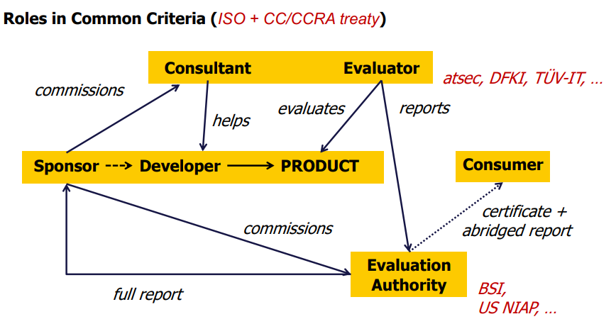
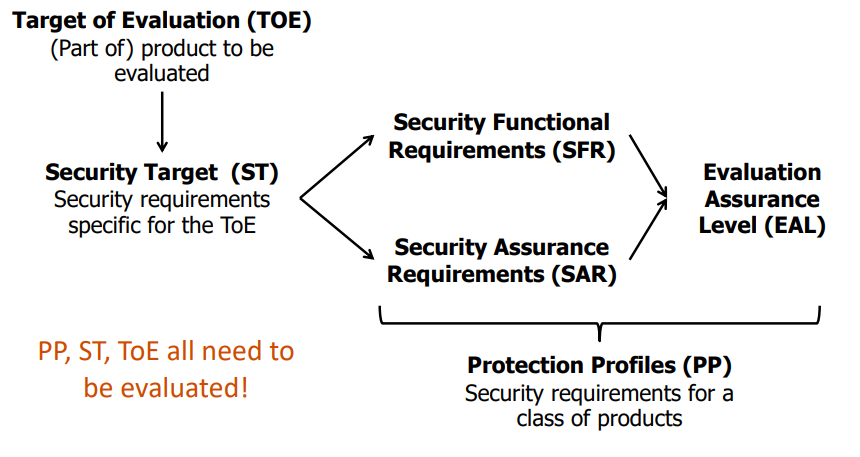
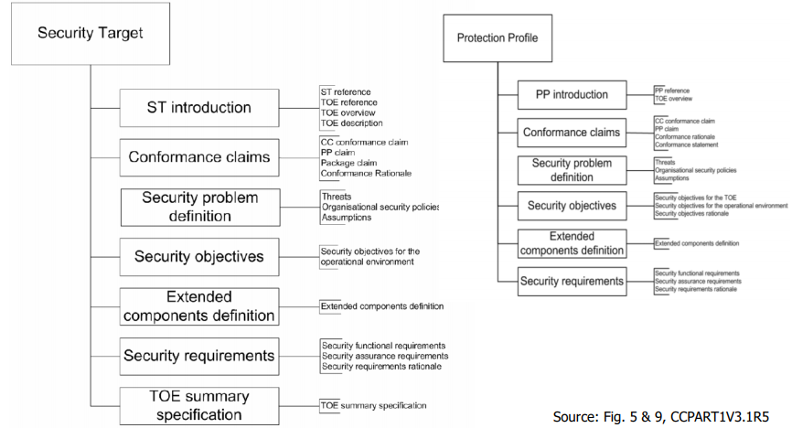
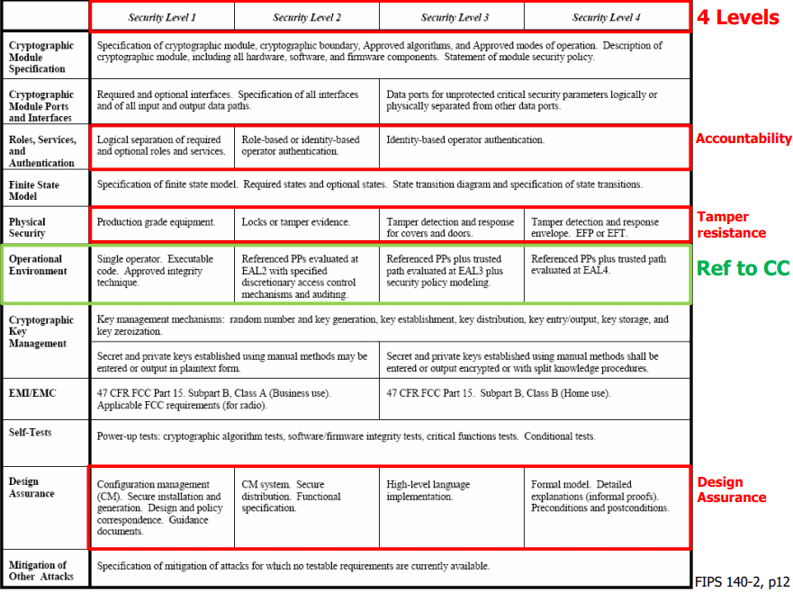

# 2.1. motivation & intro
## Security assurance provides justification that a target meets security requirements
security requirements	--->	assurance	<---	target

security requirements: desired security properties of a type of product

assurance: certification that target meets requirements

target: product of part of a product

## vendor's secure engineering process

**vendor**
_training_ -> 1. requirements -> 2. design -> 3. implementation -> 4. verification -> 5. release [mandatory docs, tools, tests, reviews, verification, ...]

**buyer**
_response_

### 3rd party assurance
independent evaluation & certification

covering most phases

ideal: augmenting internal assurance

just before/after release

third party assurance 

__Main drivers for assurance are government policies__
**1. Driver: Government policies**
**2. Driver: Commercial expectations**

# 2.2. trusted computer ststem evaluation criteria
rainbow series(us)

TUSEC 1st. security assurance standard

security functional requirements (SFR): specific for OS, architecture, functions, policy models

security assurance requirements (SAR): documentation, design and test methodology, actual tests

**A** - Verified Protection

A1: verified design

**B** - Mandatory Protection

B3: security domains

B2: structured protection

B1: labeled security protection

**C** - Diecretionary protection

C2: controlled access protection

C1: discretionary security protection

**D** - Minimal protection

D1: minimal protection

Market accepted functional difference between B1 and C2
below C1(weak) and above B2(expensive)
focus too narrow: os(no network, no app.)

# 2.3. Common Criteria (Version 3.1 revision 5)
Basic Terminology 

EAL 1: Functionally tested

EAL 2: Structurally tested

EAL 3: Methodically tested and checked

EAL 4: Methodically designed, tested and reviewed

EAL 5: Semi-formally designed and tested

EAL 6: Semi-formally verified design and tested

EAL 7: Formally verified design and tested

**Target of evaluation (TOE) is a set of softfirm- or hardware possibly with guidance.**

**Protection Profiles (PP) capture the security needs of a class of products whereas Security Targets (ST) capture security needs of a specific product.**

### Security Targets and Protection Profiles 

### Security requirements consist of functional and assurance requirements
**Security Functional Requirements (SFR)**: translation of the security objectives for the TOE into a standardized language

Use of standardized language to:

1. provide an exact description of what is to be evaluated

2. allow comparison between two security targets

**Security Assurance Requirements (SAR)**: description of how assurance is to be gained that the TOE meets the SFRs

Use of standardized language to:

1. provide an exact description of how the TOE is to be evaluated

2. allow comparison between two security targets

### CC Functional Classes
Audit (FAU), 
Communications (FCO), 
Cryptography Support (FCS), 
User Data Protection (FDP), 
Identification and Authentication (FIA),
Security Management (FMT), 
Privacy (FPR), 
Protection of the TOE Security Functions (FPT), 
Resource Utilisation (FRU), 
TOE Access (FTA), 
Trusted Path/Channels (FTP)

**Each class includes a name, an introduction and functional families**
FAU_ARP: Security audit automatic
response

FAU_GEN: Security audit data generation

FAU_SAA: Security audit analysis

FAU_SAR: Security audit review

FAU_SEL: Security audit event selection

FAU_STG Security audit event storage

# 2.4. CRYPTOGRAPHIC MODULES (FIPS 140-2)
### FIPS PUB 140-2 is a US government evaluation standard for crypto modules
Most important evaluation standard for crypto modules

4 Levels: Security Level 1-4
### FIPS 

**NIST has a list of certified crypto. processors, e.g. IBM 4765 PCIe**
Hardware IBM 4765 2011.02.24, oberall level: 4

1. fips-approved algorithms: AES, RNG, RSA, SHS

2. other algorithms: DES MAC